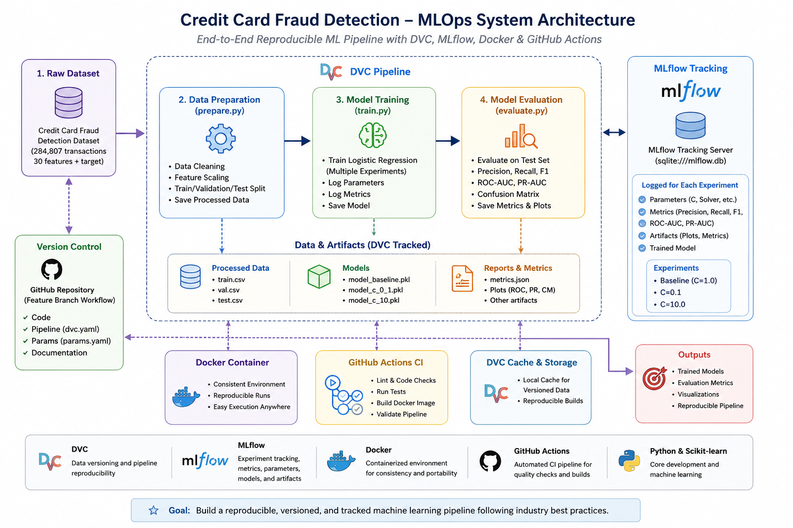

# 💳 Credit Card Fraud Detection – End-to-End MLOps Pipeline


---

## Project Overview

This project demonstrates an end-to-end MLOps workflow for detecting fraudulent credit card transactions using machine learning.

The goal is not only to build a predictive model, but also to implement industry-standard MLOps practices including reproducibility, experiment tracking, version control, and collaborative development.

---

## 🚀 Quick Start

```bash
git clone https://github.com/svanaki/credit-card-fraud-mlops.git
cd credit-card-fraud-mlops

pip install -r requirements.txt

dvc repro

mlflow ui --backend-store-uri sqlite:///mlflow.db
```

---

## Features

- Exploratory Data Analysis (EDA)
- Data preprocessing pipeline
- Multiple Logistic Regression experiments
- Model evaluation
- DVC data versioning
- Reproducible ML pipeline
- MLflow experiment tracking
- Visual experiment artifacts
- GitHub feature-branch workflow

---

## Dataset

The project uses the **Credit Card Fraud Detection** dataset.

**Features**

- Time
- Amount
- V1 – V28 (PCA transformed features)

**Target**

| Value | Meaning |
|------|---------|
| 0 | Legitimate Transaction |
| 1 | Fraudulent Transaction |

Dataset Summary

- 284,807 transactions
- 30 input features
- 1 target variable (Class)
- Highly imbalanced (~0.17% fraud)

---

# Project Structure

```text
credit-card-fraud-mlops/

├── data/
│   ├── raw/
│   └── processed/
│
├── models/
│
├── notebooks/
│
├── reports/
│   ├── figures/
│   ├── metrics/
│   └── screenshots/
│
├── src/
│   ├── prepare.py
│   ├── train.py
│   ├── evaluate.py
│   ├── config.py
│   └── utils.py
│
├── tests/
│
├── dvc.yaml
├── dvc.lock
├── params.yaml
├── requirements.txt
└── README.md
```

---

# System Architecture

```text
                 Credit Card Dataset
                         │
                         ▼
                 Data Preprocessing
                  (prepare.py + DVC)
                         │
                         ▼
                 Processed Datasets
          (train.csv / val.csv / test.csv)
                         │
                         ▼
                  Model Training
                    (train.py)
                         │
                         ▼
               Logistic Regression
                         │
                         ▼
                 Model Evaluation
                  (evaluate.py)
                         │
            ┌────────────┴────────────┐
            ▼                         ▼
      Evaluation Metrics         MLflow Tracking
        (metrics.json)      (Parameters, Metrics,
                              Artifacts, Models)
            │
            ▼
      GitHub Actions CI
            │
            ▼
      Docker Container
```



---

## Architecture

The project architecture, technology stack, and deployment strategy are documented in:

- docs/architecture.md

---

## Engineering Practices

This project follows professional software engineering practices including:

- Feature branches
- Pull Requests
- Code reviews
- GitHub Actions CI
- Docker containerization
- DVC pipeline reproducibility
- MLflow experiment tracking

---

# MLOps Pipeline

```
Raw Dataset
      │
      ▼
prepare.py
      │
      ▼
Processed Dataset
      │
      ▼
train.py
      │
      ▼
Logistic Regression
      │
      ▼
evaluate.py
      │
      ▼
Metrics
      │
      ▼
MLflow
```

---

# Technology Stack

| Category | Tools |
|-----------|------|
| Language | Python |
| Data | Pandas, NumPy |
| Machine Learning | Scikit-Learn |
| Experiment Tracking | MLflow |
| Data Versioning | DVC |
| Version Control | Git + GitHub |
| Visualization | Matplotlib |
| Containerization | Docker         |
| CI/CD            | GitHub Actions |

---

# Running the Project

## Clone

```bash
git clone https://github.com/svanaki/credit-card-fraud-mlops.git
cd credit-card-fraud-mlops
```

## Install

```bash
pip install -r requirements.txt
```

## Data Preparation

```bash
python src/prepare.py
```

## Model Training

```bash
python src/train.py
```

## Evaluation

```bash
python src/evaluate.py
```

## DVC Pipeline

```bash
dvc repro
```

## MLflow

```bash
mlflow ui --backend-store-uri sqlite:///mlflow.db
```

Open

```
http://127.0.0.1:5000
```

---

## MLflow Experiment Tracking

MLflow was used to track and compare multiple Logistic Regression experiments.

The following experiments were conducted:

| Experiment | C | Solver |
|------------|---:|--------|
| Baseline | 1.0 | lbfgs |
| Experiment 1 | 0.1 | lbfgs |
| Experiment 2 | 10.0 | lbfgs |

For each experiment, MLflow logs:

- Parameters
- Precision
- Recall
- F1-score
- ROC-AUC
- PR-AUC
- Trained model
- Evaluation artifacts

---

## DVC Pipeline

The project uses DVC for:

- Dataset versioning
- Pipeline reproducibility
- Pipeline stages:
  - prepare
  - train
  - evaluate

Additional documentation is available in:

- docs/dvc_remote.md

---

## 🐳 Docker

### Build

```bash
docker build -t credit-card-fraud-mlops .
```

### Prepare data

```bash
docker run --rm \
-v ${PWD}/data/processed:/app/data/processed \
credit-card-fraud-mlops
```

### Train

```bash
docker run --rm \
-v ${PWD}/data/processed:/app/data/processed \
-v ${PWD}/models:/app/models \
credit-card-fraud-mlops python src/train.py
```

### Evaluate

```bash
docker run --rm \
-v ${PWD}/data/processed:/app/data/processed \
-v ${PWD}/models:/app/models \
-v ${PWD}/reports/metrics:/app/reports/metrics \
credit-card-fraud-mlops python src/evaluate.py
```

---

# Screenshots

## MLflow Dashboard


---

## Experiment Details


---

## Experiment Artifacts


---

## GitHub Workflow


---

## Docker Build


---

## Docker Execution


---

# Completed Milestones

- [x] Project setup
- [x] Exploratory Data Analysis (EDA)
- [x] Data preprocessing pipeline
- [x] Dataset documentation
- [x] Architecture design and documentation
- [x] Logistic Regression baseline model
- [x] Multiple MLflow experiments and comparison
- [x] Model evaluation and metrics reporting
- [x] DVC pipeline (prepare → train → evaluate)
- [x] MLflow experiment tracking and artifacts
- [x] Docker containerization
- [x] GitHub Actions CI pipeline

---

## Project Status

**Current Status:** ✅ Phase 1 Completed

This repository implements the complete Phase 1 MLOps workflow, including:

- Dataset documentation
- Architecture design
- DVC pipeline
- MLflow experiment tracking
- Docker containerization
- GitHub Actions continuous integration

---

## 🚀 Future Improvements

- [ ] Random Forest model
- [ ] XGBoost model
- [ ] Hyperparameter tuning
- [ ] FastAPI deployment
- [ ] Cloud deployment (Render/Railway)
- [ ] Model monitoring (Evidently AI)
- [ ] Automated retraining

---

## Authors

Group 09: Soodeh Vanaki - Ryan Caezar Soria - Anurag Singh

MAI201 – MLOps Project

Summer 2026

Seneca Polytechnic