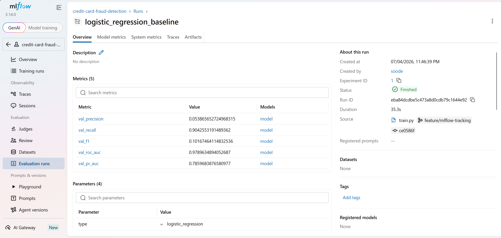
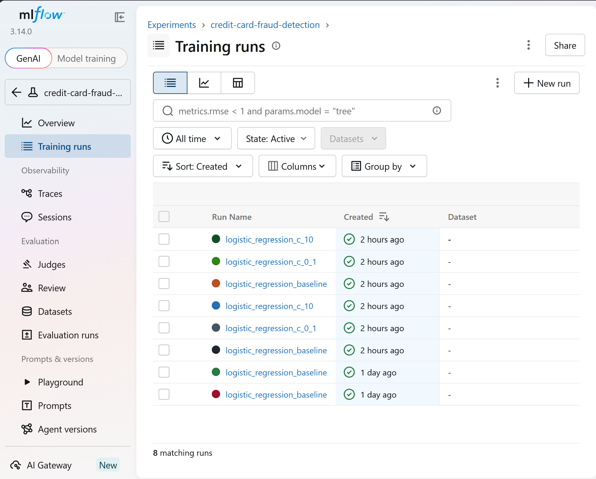
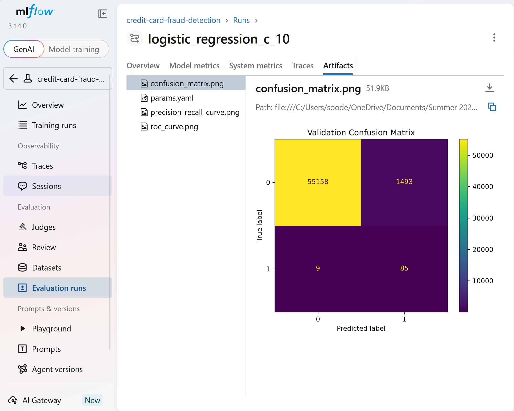
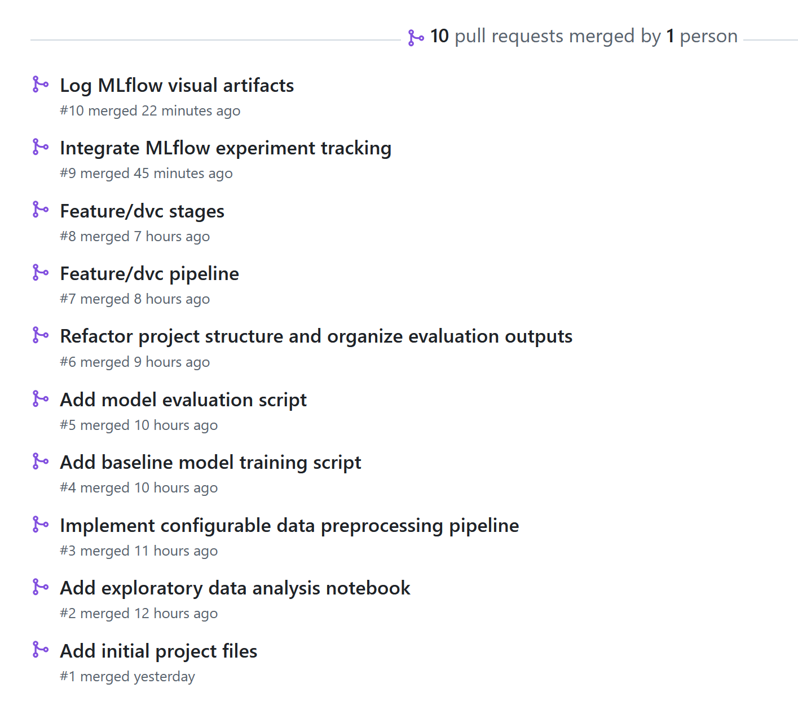
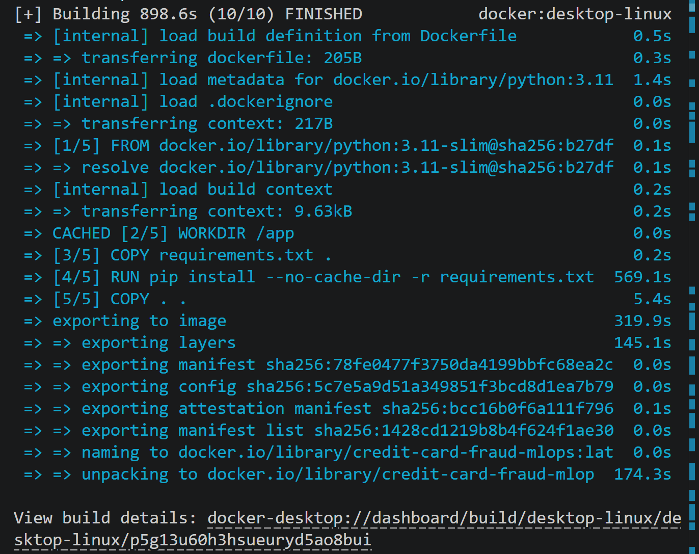
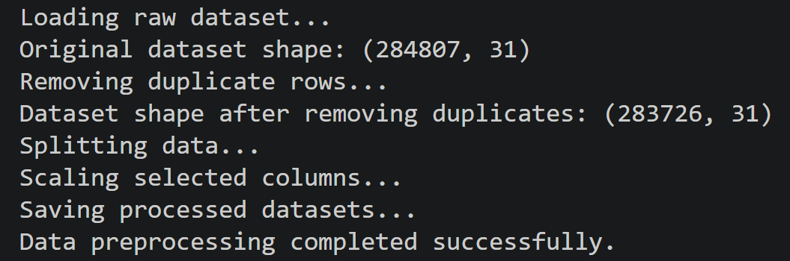

# 💳 Credit Card Fraud Detection – End-to-End MLOps Pipeline


---

## Project Overview

This project demonstrates an end-to-end MLOps workflow for detecting fraudulent credit card transactions using machine learning.

The goal is not only to build a predictive model, but also to implement industry-standard MLOps practices including reproducibility, experiment tracking, version control, and collaborative development.

---

## 🚀 Quick Start

```bash
git clone https://github.com/svanaki/credit-card-fraud-mlops.git
cd credit-card-fraud-mlops

pip install -r requirements.txt

dvc repro

mlflow ui --backend-store-uri sqlite:///mlflow.db
```

---

## Features

- Exploratory Data Analysis (EDA)
- Data preprocessing pipeline
- Logistic Regression baseline model
- Model evaluation
- DVC data versioning
- Reproducible ML pipeline
- MLflow experiment tracking
- Visual experiment artifacts
- GitHub feature-branch workflow

---

## Dataset

The project uses the **Credit Card Fraud Detection** dataset.

**Features**

- Time
- Amount
- V1 – V28 (PCA transformed features)

**Target**

| Value | Meaning |
|------|---------|
| 0 | Legitimate Transaction |
| 1 | Fraudulent Transaction |

Characteristics:

- 284,807 transactions
- 492 fraud cases
- Highly imbalanced dataset

---

# Project Structure

```text
credit-card-fraud-mlops/

├── data/
│   ├── raw/
│   └── processed/
│
├── models/
│
├── notebooks/
│
├── reports/
│   ├── figures/
│   ├── metrics/
│   └── screenshots/
│
├── src/
│   ├── prepare.py
│   ├── train.py
│   ├── evaluate.py
│   ├── config.py
│   └── utils.py
│
├── tests/
│
├── dvc.yaml
├── dvc.lock
├── params.yaml
├── requirements.txt
└── README.md
```

---

# MLOps Pipeline

```
Raw Dataset
      │
      ▼
prepare.py
      │
      ▼
Processed Dataset
      │
      ▼
train.py
      │
      ▼
Logistic Regression
      │
      ▼
evaluate.py
      │
      ▼
Metrics
      │
      ▼
MLflow
```

---

# Technology Stack

| Category | Tools |
|-----------|------|
| Language | Python |
| Data | Pandas, NumPy |
| Machine Learning | Scikit-Learn |
| Experiment Tracking | MLflow |
| Data Versioning | DVC |
| Version Control | Git + GitHub |
| Visualization | Matplotlib |

---

# Running the Project

## Clone

```bash
git clone https://github.com/svanaki/credit-card-fraud-mlops.git
cd credit-card-fraud-mlops
```

## Install

```bash
pip install -r requirements.txt
```

## Data Preparation

```bash
python src/prepare.py
```

## Model Training

```bash
python src/train.py
```

## Evaluation

```bash
python src/evaluate.py
```

## DVC Pipeline

```bash
dvc repro
```

## MLflow

```bash
mlflow ui --backend-store-uri sqlite:///mlflow.db
```

Open

```
http://127.0.0.1:5000
```

---

# MLflow Experiment Tracking

Each experiment logs:

- Model parameters
- Evaluation metrics
- Trained model
- Confusion Matrix
- ROC Curve
- Precision–Recall Curve
- Project configuration (`params.yaml`)

---

## 🐳 Docker

### Build the Docker image

```bash
docker build -t credit-card-fraud-mlops .
```

### Run the preprocessing pipeline

```bash
docker run --rm credit-card-fraud-mlops
```

### Train the model

```bash
docker run --rm credit-card-fraud-mlops src/train.py
```

### Evaluate the model

```bash
docker run --rm credit-card-fraud-mlops src/evaluate.py
```

---

# Screenshots

## MLflow Dashboard

*(Insert screenshot here)*



---

## Experiment Details

*(Insert screenshot here)*



---

## Experiment Artifacts

*(Insert screenshot here)*



---

## GitHub Workflow

*(Insert screenshot here)*



---

## Docker Build



---

## Docker Execution



---

# Completed Milestones

- [x] Project setup
- [x] Exploratory Data Analysis
- [x] Data preprocessing
- [x] Logistic Regression baseline
- [x] Model evaluation
- [x] DVC pipeline
- [x] MLflow experiment tracking
- [x] MLflow visual artifacts

---

## 🚀 Future Improvements

- [ ] Random Forest model
- [ ] XGBoost model
- [ ] Hyperparameter tuning
- [ ] Docker containerization
- [ ] GitHub Actions CI/CD pipeline
- [ ] Model deployment using FastAPI
- [ ] Model monitoring and drift detection

---

## Authors

Group 09: Soodeh Vanaki - Ryan Caezar Soria - Anurag Singh

MAI201 – MLOps Project

Summer 2026

Seneca Polytechnic