# 💳 Credit Card Fraud Detection – End-to-End MLOps Pipeline

This project demonstrates a complete production-oriented MLOps workflow for credit card fraud detection, including data versioning, experiment tracking, cloud deployment, monitoring, and automated retraining.


[](https://credit-card-fraud-mlops-jy3a.onrender.com/docs)

---

---

## Project Overview

This project demonstrates an end-to-end MLOps workflow for detecting fraudulent credit card transactions using machine learning.

The goal is not only to build a predictive model, but also to implement industry-standard MLOps practices including reproducibility, experiment tracking, version control, and collaborative development.

---

---

## ⭐ Project Highlights

- End-to-end reproducible MLOps pipeline
- DVC data and model versioning
- MLflow experiment tracking
- Dockerized FastAPI inference service
- Public cloud deployment on Render
- Automated testing with Pytest
- GitHub Actions CI/CD
- Ruff linting and formatting checks
- Explicit data validation in CI
- Model Card documentation

---

---

## 🚀 Quick Start

### Option 1 – Use the Public API (Recommended)

The API is publicly available on Render:

**Base URL**

```
https://credit-card-fraud-mlops-jy3a.onrender.com
```

Interactive API documentation:

```
https://credit-card-fraud-mlops-jy3a.onrender.com/docs
```

No installation is required.

---

### Option 2 – Run Locally

```bash
git clone https://github.com/svanaki/credit-card-fraud-mlops.git

cd credit-card-fraud-mlops

pip install -r requirements.txt

dvc pull

dvc repro

uvicorn src.api:app --reload
```

---

### Option 3 - Run with Docker

```bash
docker build -t credit-card-fraud-mlops .

docker run -p 8000:8000 \
-e MODEL_PATH=deployment_artifacts/fraud_model.pkl \
-e SCALER_PATH=deployment_artifacts/scaler.pkl \
credit-card-fraud-mlops
```

Open:

```
http://localhost:8000/docs
```

## Workflow
```
    Prepare Data
         ↓
     Train Model
         ↓
      Evaluate
         ↓
      Serve API
         ↓
       Monitor
         ↓
 Retrain (if required)
```
---

---

## Features

- Exploratory Data Analysis (EDA)
- Data preprocessing pipeline
- Logistic Regression baseline model
- Multiple MLflow experiments
- Model evaluation
- FastAPI inference API
- Interactive Swagger documentation
- Dockerized deployment
- Cloud deployment on Render
- DVC data versioning
- MLflow experiment tracking
- GitHub Actions CI/CD
- Ruff linting and formatting checks
- Explicit data validation in CI
- Model Card documentation

---

---

## Dataset

The project uses the **Credit Card Fraud Detection** dataset.

**Features**

- Time
- Amount
- V1 – V28 (PCA transformed features)

**Target**

| Value | Meaning |
|------|---------|
| 0 | Legitimate Transaction |
| 1 | Fraudulent Transaction |

Dataset Summary

- 284,807 transactions
- 30 input features
- 1 target variable (Class)
- Highly imbalanced (~0.17% fraud)

---

---

# Project Structure

```text
credit-card-fraud-mlops/

├── data/
│   ├── raw/
│   └── processed/
│
├── deployment_artifacts/
│
├── models/
│
├── notebooks/
│
├── docs/
│
├── reports/
│   ├── figures/
│   ├── metrics/
│   ├── monitoring/
│       ├── baseline/
│       └── simulated/
│   ├── retraining/
│   ├── reports/
│   └── screenshots/
│
├── src/
│   ├── prepare.py
│   ├── train.py
│   ├── evaluate.py
│   ├── config.py
│   ├── utils.py
│   ├── api.py
│   ├── monitor.py
│   ├── simulate_drift.py
│   ├── retrain.py
│   ├── model_comparison.py
│   └── schemas.py
│
├── tests/
│
├── dvc.yaml
├── dvc.lock
├── params.yaml
├── requirements.txt
├── pytest.ini
├── model_card.md
├── ruff.toml
└── README.md
```

---

---

# System Architecture

```text
                 Credit Card Dataset
                         │
                         ▼
                 Data Preprocessing
                  (prepare.py + DVC)
                         │
                         ▼
                 Processed Datasets
          (train.csv / val.csv / test.csv)
                         │
                         ▼
                  Model Training
                    (train.py)
                         │
                         ▼
               Logistic Regression
                         │
                         ▼
                 Model Evaluation
                  (evaluate.py)
                         │
            ┌────────────┴────────────┐
            ▼                         ▼
      Evaluation Metrics         MLflow Tracking
        (metrics.json)      (Parameters, Metrics,
                              Artifacts, Models)
            └────────────┬────────────┘
                         │
                         ▼
                  GitHub Repository
                         │
                         ▼
                  GitHub Actions (CI)
                         │
                         ▼
                    Docker Image
                         │
                         ▼
                 Render Cloud Service
                         │
                         ▼
                      Training
                         │
                         ▼
                   Production Model
                         │
                         ▼
                  FastAPI REST API
                         │
                         ▼
               Swagger UI / API Clients
                         │
                         ▼
                Production Requests
                         │
                         ▼
                Evidently Monitoring
                         │
                         ▼
                  Drift Detection
                         │
                         ▼
                     Retraining
                         │
                         ▼
                  Candidate Model
                         │
                         ▼
                  Model Comparison
                         │
                         ▼
              Conditional Promotion
                         │
                         ▼
                  Production Model
```

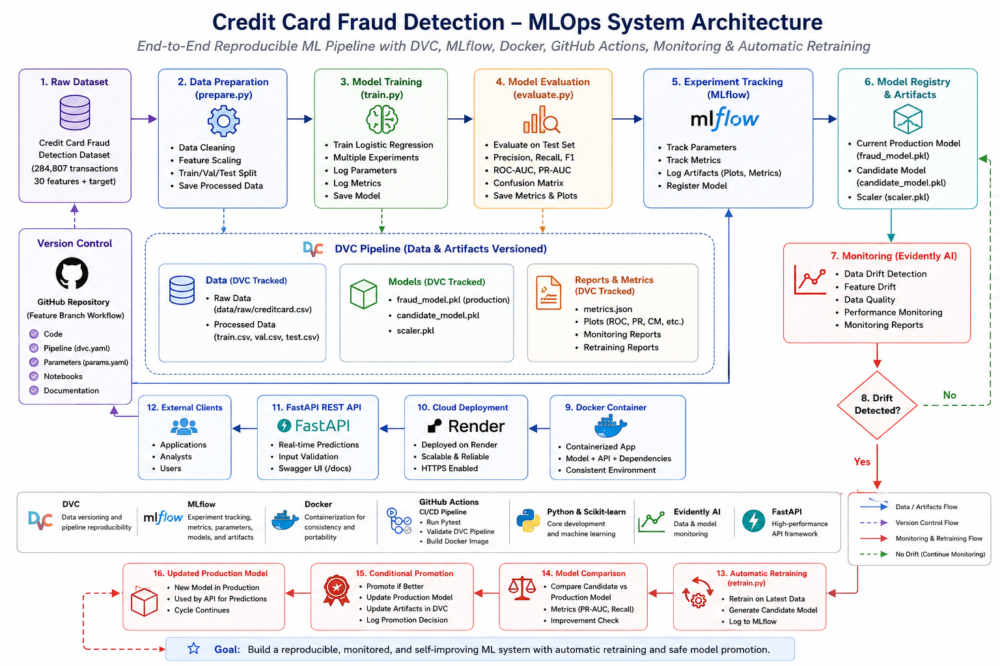

---

---

## Architecture

The project architecture, technology stack, and deployment strategy are documented in:

- docs/architecture.md

---

---

## Model Card

Detailed model documentation is available in:

- [model_card.md](model_card.md)

---

---

## Engineering Practices

This project follows professional software engineering practices including:

- Feature branches
- Pull Requests
- Code reviews
- GitHub Actions CI
- Docker containerization
- DVC pipeline reproducibility
- MLflow experiment tracking

---

---

# MLOps Pipeline

```
                     Raw Data
                         │
                         ▼
                      Prepare
                         │
                         ▼
                       Train
                         │
                         ▼
                      Evaluate
                         │
                         ▼
                      MLflow
                         │
                         ▼
                      Docker
                         │
                         ▼
                       Render
                         │
                         ▼
                      FastAPI
                         │
                         ▼
                     Monitoring
                         │
                         ▼
                     Retraining
                         │
                         ▼
                     Promotion
```

---

---

# Technology Stack

| Category | Tools |
|-----------|------|
| Language | Python |
| Data | Pandas, NumPy |
| Machine Learning | Scikit-Learn |
| Experiment Tracking | MLflow |
| Data Versioning | DVC |
| Version Control | Git + GitHub |
| Visualization | Matplotlib |
| Containerization | Docker         |
| CI/CD            | GitHub Actions |
| Code Quality | Ruff |
| Testing | Pytest |
| Monitoring | Evidently AI |
| API | FastAPI |
| Deployment | Render |
---

---

# Running the Project

## Clone

```bash
git clone https://github.com/svanaki/credit-card-fraud-mlops.git
cd credit-card-fraud-mlops
```

## Install

```bash
pip install -r requirements.txt
```

## Data Preparation

```bash
python -m src.prepare
```

## Model Training

```bash
python -m src.train
```

## Evaluation

```bash
python -m src.evaluate
```
---

---

### GitHub Workflow

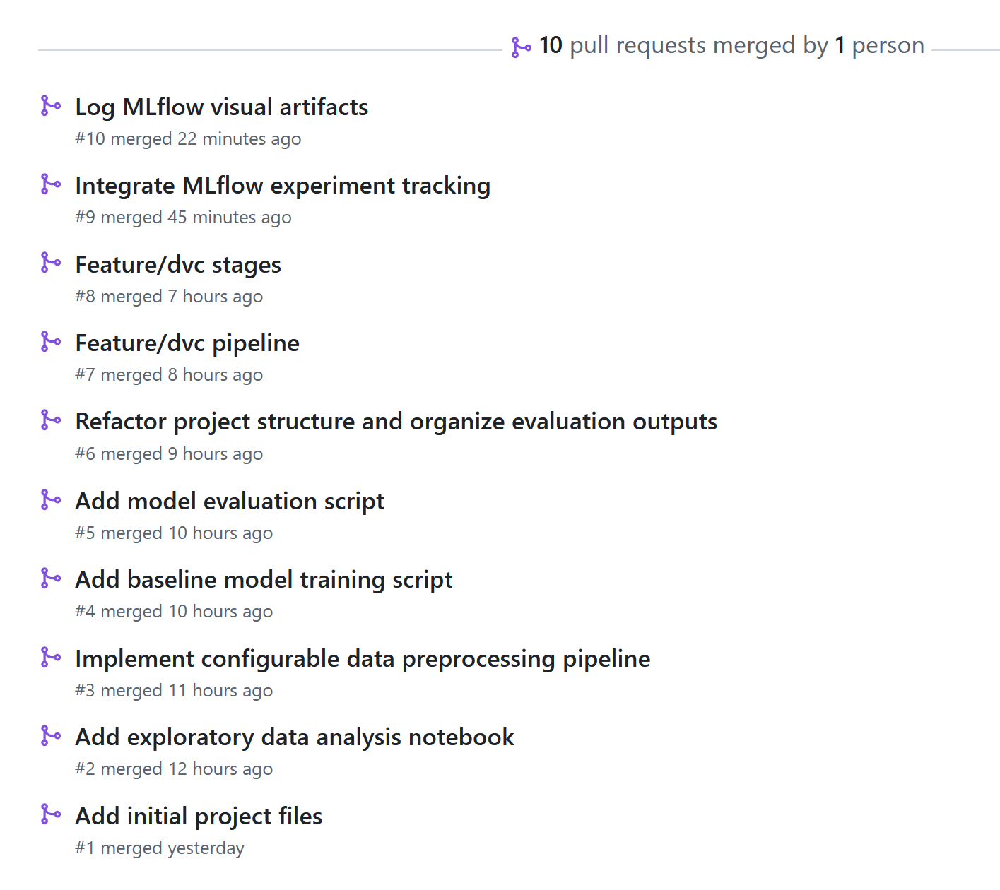

---

---

## DVC Pipeline

The project uses DVC for:

- Raw and processed data versioning
- Model artifact versioning
- Shared Google Drive remote storage
- Reproducible pipeline execution
- Three pipeline stages:
  - prepare
  - train
  - evaluate

Retrieve the DVC-managed artifacts with:

```bash
dvc pull
```
Additional documentation is available in:

- docs/dvc_remote.md

---

> **Note**
>
> This project uses a shared Google Drive DVC remote for versioning datasets and model artifacts.

> Access to the remote storage is restricted to project team members. Users without permission can still clone the repository and review the complete source code, DVC pipeline configuration, and documentation, but `dvc pull` requires access to the shared DVC remote.

> For evaluation purposes, the repository includes the complete pipeline implementation (`dvc.yaml`, `dvc.lock`, source code, and documentation). The remote storage is used only for sharing DVC-managed artifacts among project collaborators.

## MLflow

```bash
mlflow ui --backend-store-uri sqlite:///mlflow.db
```

Open

```
http://127.0.0.1:5000
```

---

---

## MLflow Experiment Tracking

MLflow was used to track and compare multiple Logistic Regression experiments.

The following experiments were conducted:

| Experiment | C | Solver |
|------------|---:|--------|
| Baseline | 1.0 | lbfgs |
| Experiment 1 | 0.1 | lbfgs |
| Experiment 2 | 10.0 | lbfgs |

For each experiment, MLflow logs:

- Parameters
- Precision
- Recall
- F1-score
- ROC-AUC
- PR-AUC
- Trained model
- Evaluation artifacts

---

### MLflow Dashboard

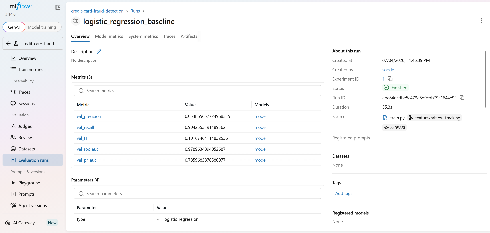

---

### Experiment Details

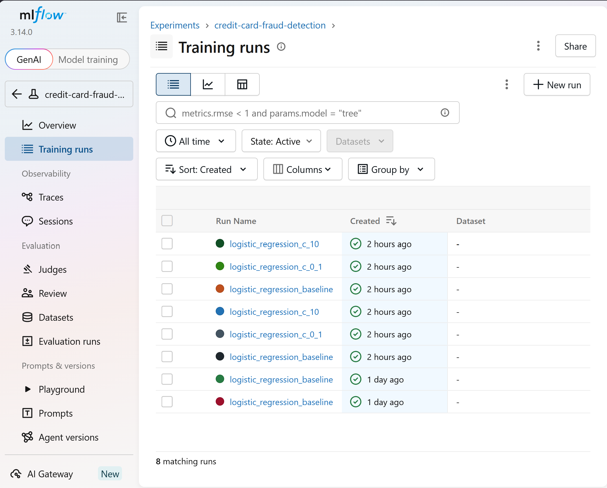

---

### Experiment Artifacts

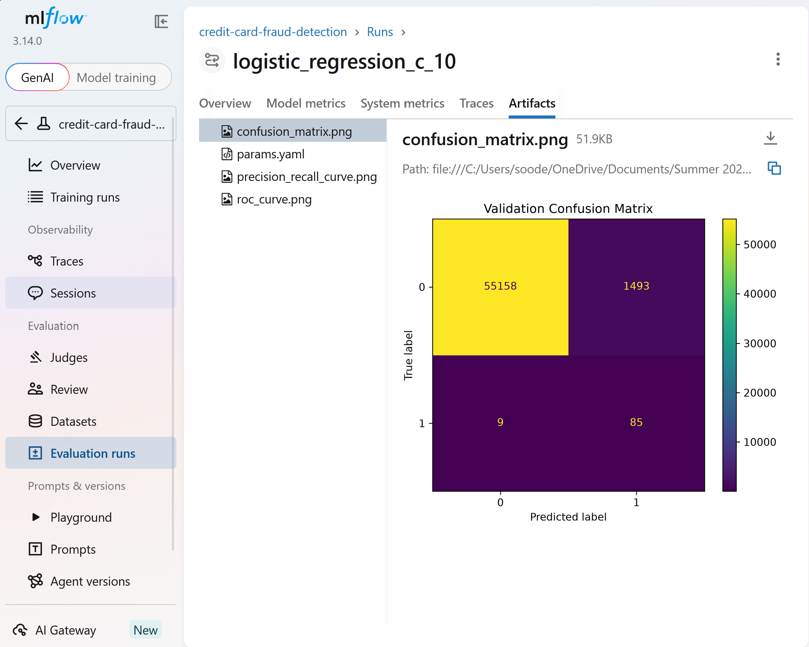

---

---

## 🐳 Docker

### Build

```bash
docker build -t credit-card-fraud-mlops .
```

### Prepare data

```bash
docker run --rm \
  -v ${PWD}/data/raw:/app/data/raw \
  -v ${PWD}/data/processed:/app/data/processed \
  -v ${PWD}/models:/app/models \
  credit-card-fraud-mlops \
  python -m src.prepare
```

### Train

```bash
docker run --rm \
  -v ${PWD}/data/processed:/app/data/processed \
  -v ${PWD}/models:/app/models \
  -v ${PWD}/reports:/app/reports \
  credit-card-fraud-mlops \
  python -m src.train
```

### Evaluate

```bash
docker run --rm \
  -v ${PWD}/data/processed:/app/data/processed \
  -v ${PWD}/models:/app/models \
  -v ${PWD}/reports/metrics:/app/reports/metrics \
  credit-card-fraud-mlops \
  python -m src.evaluate
```
---

### Docker Build

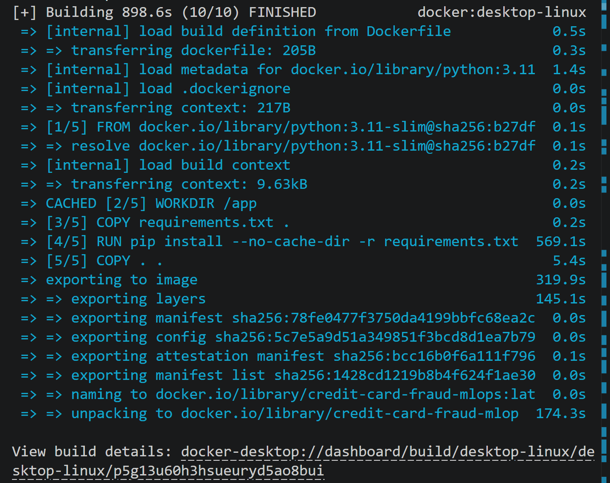

---

### Docker Execution

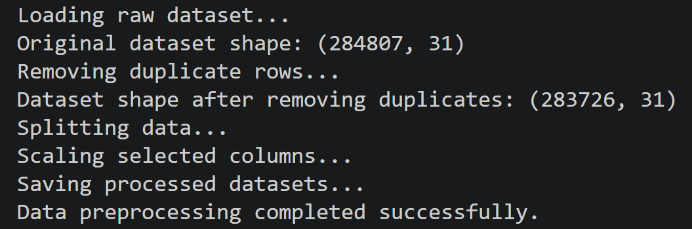

---

---

## REST API

The project exposes a FastAPI-based REST API for fraud prediction.

### Available Endpoints

| Method | Endpoint | Description |
|---------|----------|-------------|
| GET | / | API information |
| GET | /health | Health check |
| GET | /version | API version |
| GET | /model-info | Model information |
| POST | /predict | Predict fraud probability |

---

---

## Cloud Deployment

The Credit Card Fraud Detection API is deployed on Render.

### Public API

Base URL:
https://credit-card-fraud-mlops-jy3a.onrender.com

### Endpoints

GET /

GET /health

GET /version

GET /model-info

POST /predict

### Interactive API Documentation

https://credit-card-fraud-mlops-jy3a.onrender.com/docs

---

### Render Dashboard

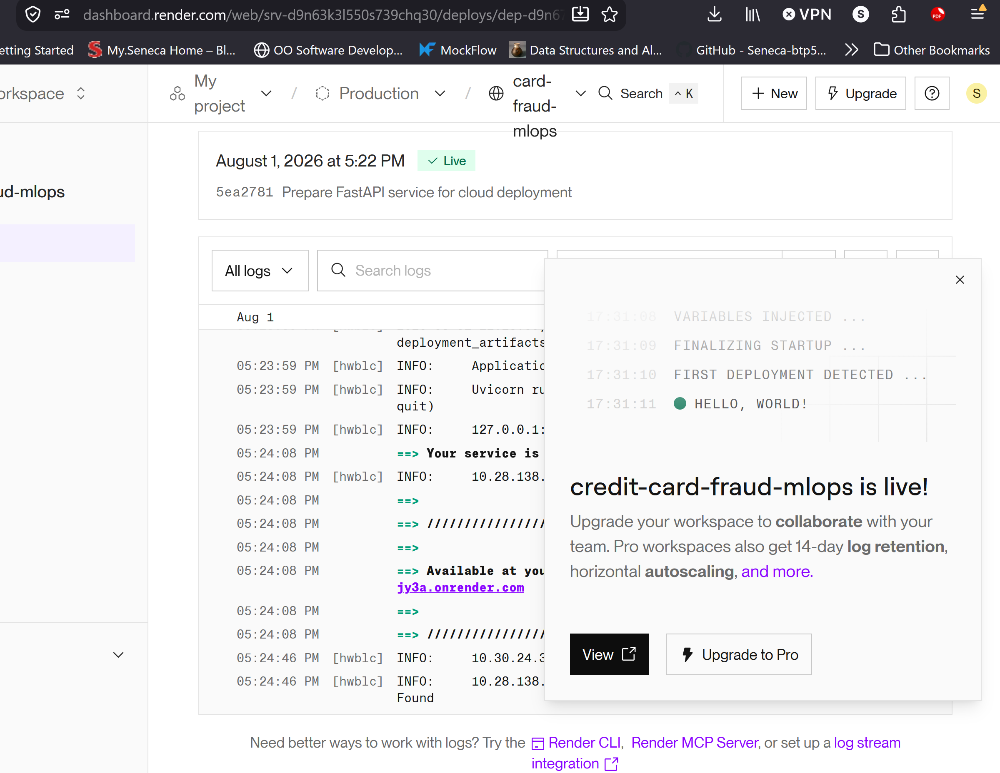

---

### Swagger UI

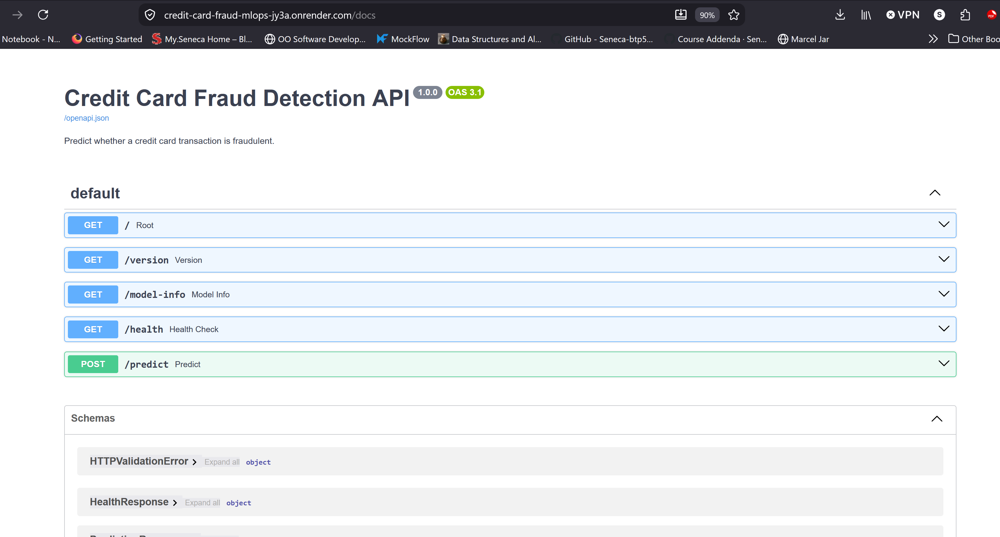

---

### Health endpoint

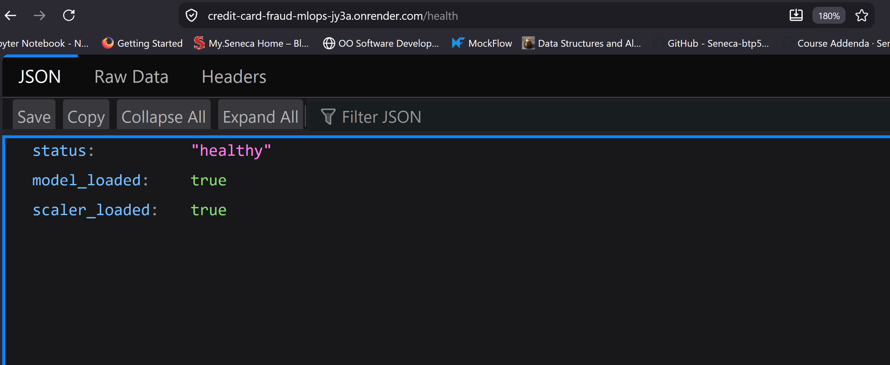

---

### Prediction Endpoint

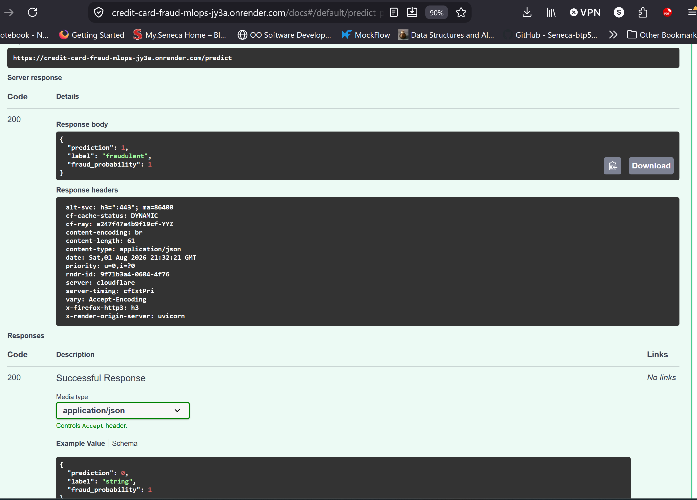

---

---

## Model Monitoring with Evidently AI

The project uses Evidently AI to compare a reference dataset with current data and identify changes in feature distributions.

### Monitoring Scenarios

| Scenario | Drifted Features | Drift Share | Retraining |
|---|---:|---:|---|
| Baseline test data | 0 / 30 | 0.00% | Not recommended |
| Simulated production drift | 20 / 30 | 64.52% | Recommended |

The simulated scenario intentionally shifts `Time`, `Amount`, and `V1–V18`. It is used only to demonstrate the monitoring and retraining workflow and does not represent real production behaviour.

### Generate Baseline Report

```bash
python -m src.monitor \
  --current data/processed/test.csv \
  --output-dir reports/monitoring/baseline
```

### Generate Simulated Drift Report

Monitoring reports are automatically generated as HTML and JSON artifacts.

```bash
python -m src.simulate_drift

python -m src.monitor \
  --current data/monitoring/simulated_drift.csv \
  --output-dir reports/monitoring/simulated
```
---

### Monitoring Results

#### Baseline Monitoring

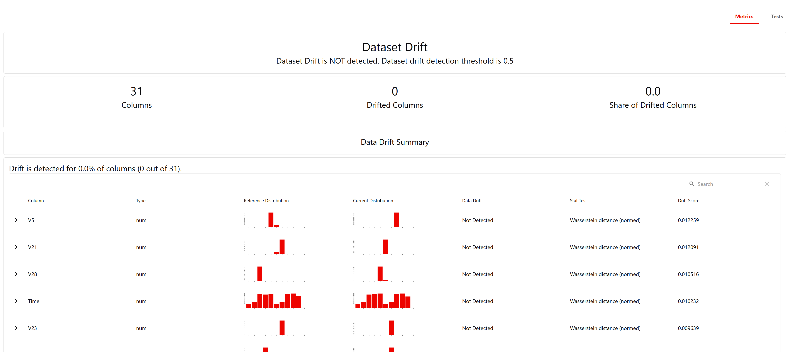

#### Simulated Drift

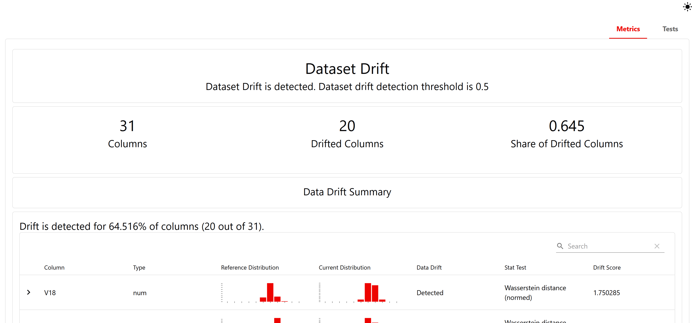

---

---

## Automatic Retraining

The project implements an automated retraining workflow driven by Evidently AI monitoring.

Workflow:

1. Monitor incoming data.
2. Detect drift.
3. Train candidate model.
4. Compare models.
5. Promote if performance improves.

The candidate model is promoted only if:

- PR-AUC is greater than or equal to the current production model.
- Recall remains within the configured tolerance.

Otherwise, the current production model is preserved.

### No-drift scenario

```bash
python -m src.retrain \
  --decision reports/monitoring/baseline/retraining_decision.json
```

### Drift-triggered scenario

```bash
python -m src.simulate_drift

python -m src.retrain \
  --decision reports/monitoring/simulated/retraining_decision.json \
  --current-data data/monitoring/simulated_drift.csv
```

---

### Automatic Retraining MLflow

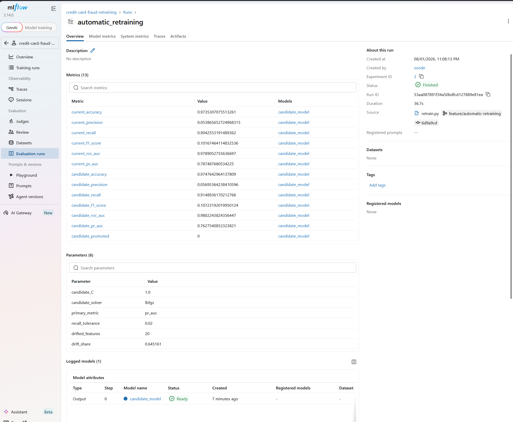

### Model Comparison

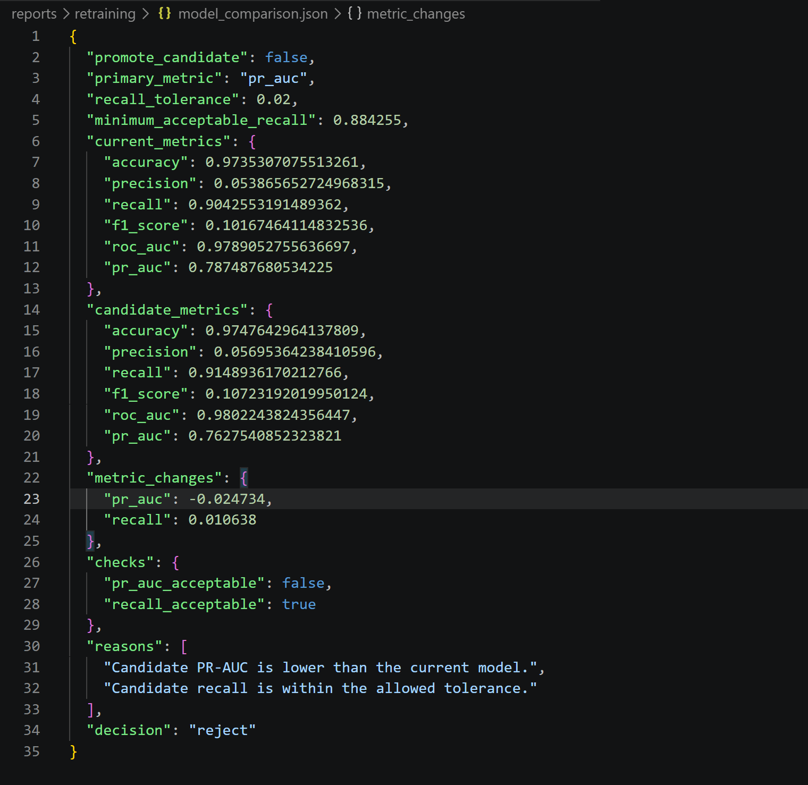

---

---

## Code Quality and Testing

```bash
ruff check src tests
ruff format --check src tests
python -m pytest -v
```

---

---

## Completed Milestones

- [x] Project setup
- [x] Exploratory Data Analysis
- [x] Data preprocessing
- [x] Dataset documentation
- [x] Architecture design
- [x] Logistic Regression baseline
- [x] Multiple MLflow experiments
- [x] Model evaluation
- [x] DVC pipeline
- [x] MLflow experiment tracking
- [x] Docker containerization
- [x] GitHub Actions CI
- [x] FastAPI REST API
- [x] API testing with Pytest
- [x] Cloud deployment (Render)
- [x] Evidently AI monitoring
- [x] Baseline drift report
- [x] Simulated production drift detection
- [x] Machine-readable retraining recommendation
- [x] Automated model retraining
- [x] Conditional model promotion with rollback protection
- [x] Ruff linting and formatting checks
- [x] Data validation in CI
- [x] Model Card
- [x] Automatic deployment from `main`

---

---

## Project Status

**Current Status:** ✅ End-to-End MLOps Pipeline Completed

✅ Phase 1 Completed

This repository implements the complete Phase 1 MLOps workflow, including:

- Dataset documentation
- Architecture design
- DVC pipeline
- MLflow experiment tracking
- Docker containerization
- GitHub Actions continuous integration

✅ Phase 2 Completed

Completed:

- End-to-end DVC pipeline
- MLflow experiment tracking
- Dockerized training pipeline
- FastAPI inference service
- Automated API testing
- Public cloud deployment on Render
- Evidently AI monitoring
- Automated retraining
- Ruff linting and formatting checks
- Data validation in CI
- Model Card
- Automatic deployment from `main`

---

---

## Lessons Learned

This project demonstrates a complete MLOps lifecycle, including data versioning, experiment tracking, API deployment, continuous integration, monitoring, and automated retraining.

One of the most important lessons learned is that detecting data drift does not automatically mean a newly trained model should replace the production model. To address this, the project implements a model comparison and promotion workflow that evaluates the candidate model against the current production model using PR-AUC and recall. The candidate is promoted only when it satisfies the predefined performance criteria, helping protect the reliability of the deployed system.

This workflow highlights the importance of combining machine learning with software engineering practices to build reliable, maintainable, and reproducible AI systems.

---

---

## 🚀 Future Improvements

- Add scheduled monitoring using GitHub Actions with authenticated DVC access.
- Evaluate additional models such as Random Forest and XGBoost.
- Integrate a production model registry.

---

---

## Repository Access

This repository is intended for academic evaluation.

- All source code, documentation, and pipeline configuration are publicly available.
- DVC-managed artifacts are stored in a shared remote accessible to project collaborators.
- The repository can be fully reviewed without access to the private DVC remote.

---

---

## Authors

Group 09: Soodeh Vanaki - Ryan Caezar Soria - Anurag Singh

MAI201 – MLOps Project

Summer 2026

Seneca Polytechnic
